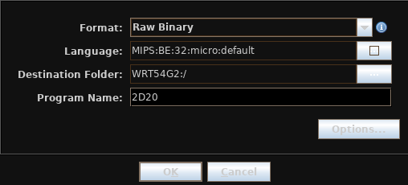
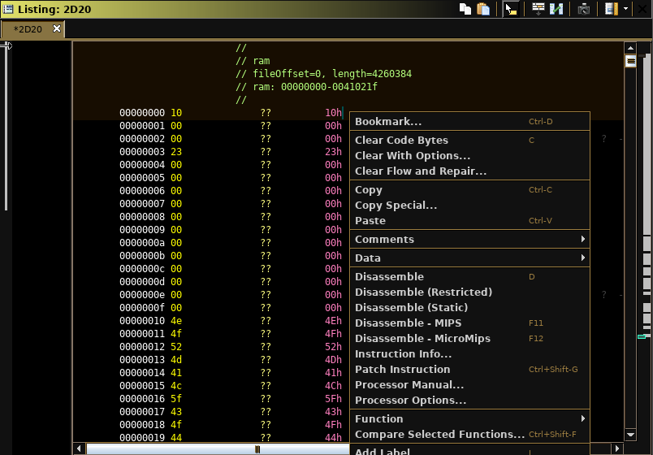
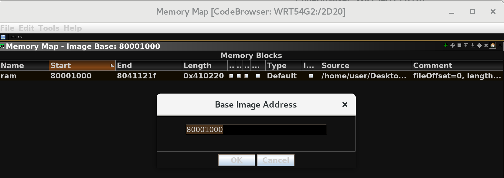
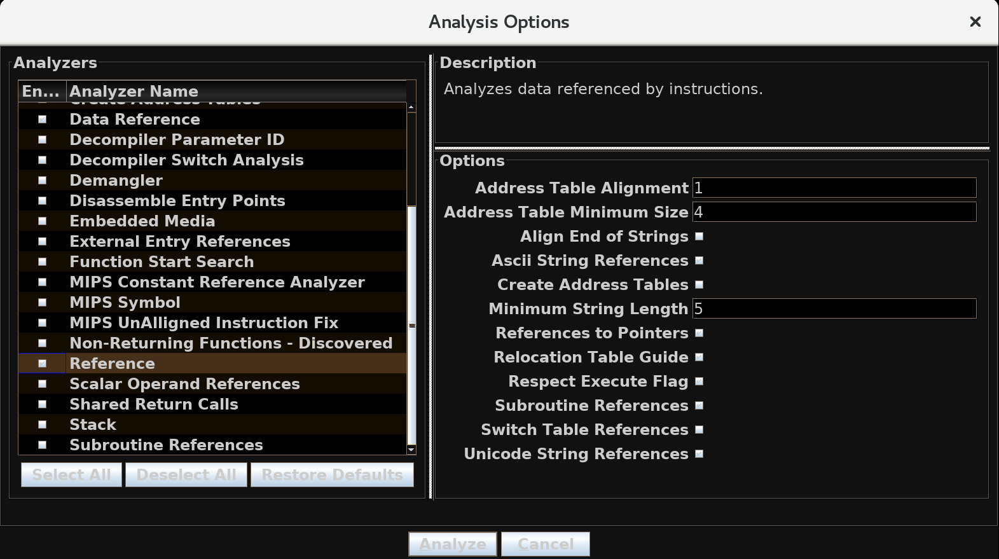
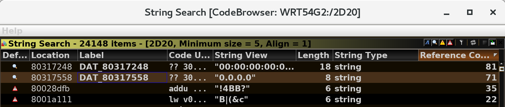
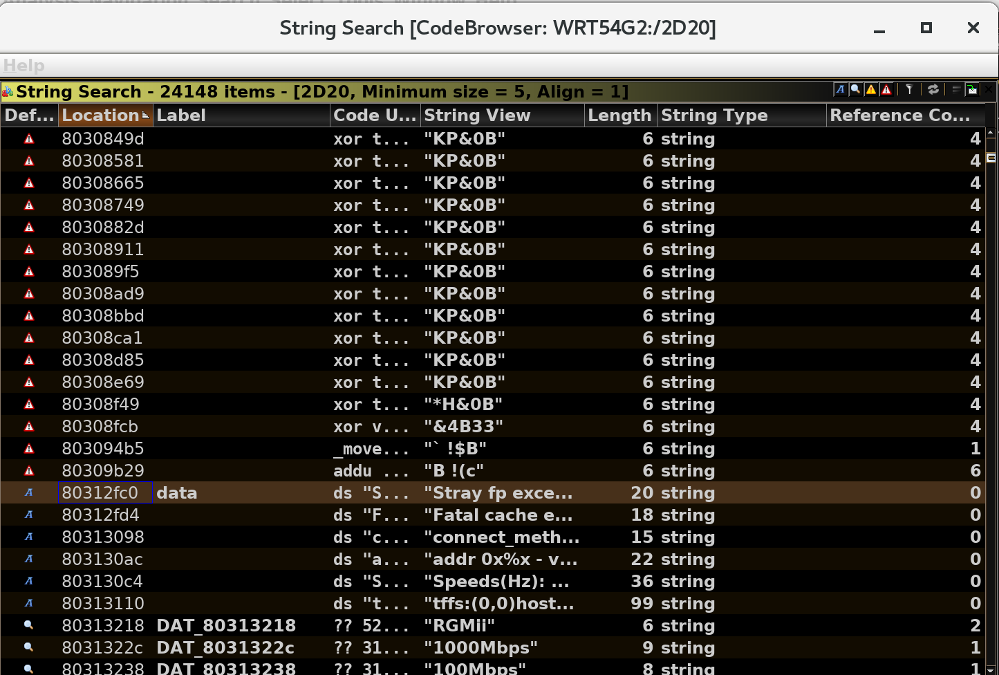
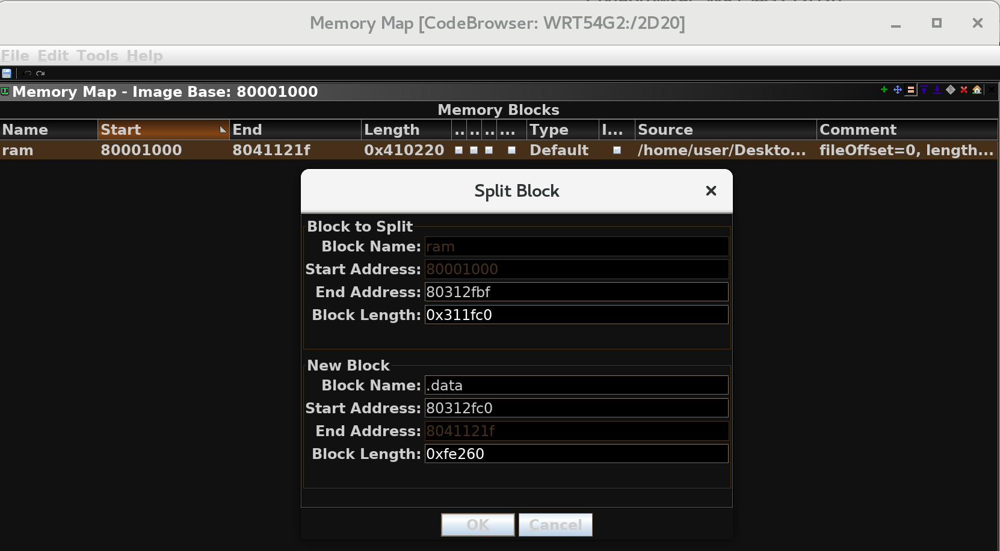
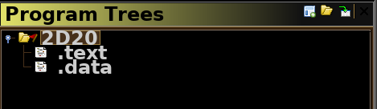
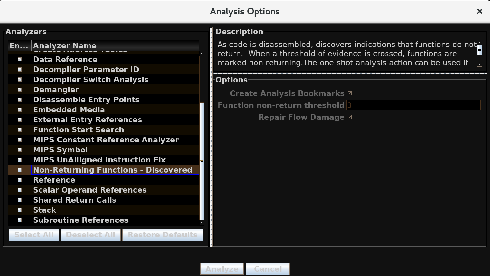

# Reverse Engineering WRT54G2 Firmware

[TOC]

## Examine the Firmware Image

Start with the official binary of the firmware:

- [Support Page](https://www.linksys.com/us/support-article?articleNum=148613)
- [FW_WRT54G2V1.5_1.5.02.005_US_20120221.bin](http://downloads.linksys.com/downloads/firmware/1224645151888/FW_WRT54G2V1.5_1.5.02.005_US_20120221.bin)
- MD5 Sum: `3c5cd278512e09a7e4d83e9a6dde645b`
- Local Cached Copy:
  - TODO

### What RTOS does it use?

Use `strings -n 10` to get longer strings of length greater than or equal to 10:

```
$ strings -n 10 FW_WRT54G2V1.5_1.5.02.005_US_20120221.bin
LINKSYS_en
VxWorks5.5
Feb 21 2012, 17:23:25
...
```

This is likely `VxWorks5.5`

### What CPU architecture?

Use `binwalk` to see architecture signatures:

```
$ binwalk -A FW_WRT54G2V1.5_1.5.02.005_US_20120221.bin

DECIMAL       HEXADECIMAL     DESCRIPTION
--------------------------------------------------------------------------------
996           0x3E4           MIPS instructions, function epilogue
7292          0x1C7C          MIPS instructions, function epilogue
7372          0x1CCC          MIPS instructions, function epilogue
8352          0x20A0          MIPS instructions, function epilogue
10328         0x2858          MIPS instructions, function epilogue
```

This is likely MIPs (Big Endian)

### Extract the compressed data

Use `binwalk` to scan file and auto-extract compressed files:

```
$ binwalk -e FW_WRT54G2V1.5_1.5.02.005_US_20120221.bin

DECIMAL       HEXADECIMAL     DESCRIPTION
--------------------------------------------------------------------------------
0             0x0             BIN-Header, board ID: G2V3, hardware version: 4702, firmware version: 8.5.5, build date: 2012-02-21
512           0x200           ELF, 32-bit MSB MIPS-II executable, MIPS, version 1 (SYSV)
11552         0x2D20          LZMA compressed data, properties: 0x6C, dictionary size: 8388608 bytes, uncompressed size: 4260384 bytes
1182904       0x120CB8        gzip compressed data, has original file name: "ChgLan.htm", from NTFS filesystem (NT), last modified: 2009-09-22 09:29:49
1183608       0x120F78        gzip compressed data, has original file name: "Cysaja.asp", from NTFS filesystem (NT), last modified: 2009-09-22 09:29:49
...
```

This image is a router called `WRT54G2` that runs on `VxWorks5.5` using a MIPS (big endian) architecture. Also, there is a `32-bit MSB MIPS-II executable` ELF header at offset `0x200` followed by LZMA compressed web server HTML/CSS/JavaScript files. This MIPS executable file is extracted as `2D20` by `binwalk` and is likely the kernel image due to its size:

```
$ cd _FW_WRT54G2V1.5_1.5.02.005_US_20120221.bin.extracted
$ ls -lahS
total 11M
-rw-rw-r--. 1 user user 4.1M Sep  9 19:45 2D20
-rw-rw-r--. 1 user user 1.7M Sep  9 19:45 2D20.7z
-rw-rw-r--. 1 user user 337K Sep  9 19:45 18516C
-rw-rw-r--. 1 user user 284K Sep  9 19:45 1581AC.7z
-rw-rw-r--. 1 user user 259K Sep  9 19:45 15E498.7z
-rw-rw-r--. 1 user user 235K Sep  9 19:45 1644F8.7z
-rw-rw-r--. 1 user user 229K Sep  9 19:45 171AE8
...
```

### Disassemble first 300 bytes of RTOS code with `rasm2`

The first instruction jumps to a file offset of `0x90`, which then likely jumps again to `0x140008`.

```assembly
$ rasm2 -d -a mips -e -l 300 -B -f 2D20 
b 0x90
nop
nop
nop
invalid
invalid
invalid
invalid
j 0x140008
bz.h w18, 0x158f4
addiu t4, v0, 0x414e
bz.w w16, 0x1053c
invalid
invalid
invalid
movf zero, t0, fcc0
addiu t5, v0, 0x4f44
invalid
invalid
bnel k0, s2, 0x15124
ori a3, v0, 0x3200
addiu t7, v0, 0x454d
invalid
invalid
invalid
beql k0, ra, 0x19620
tge v0, v1, 0x1bd
st.d w5, 0xb90(t5)
invalid
andi s0, at, 0x392d
andi s0, s1, 0x3130
addi v1, v0, 0x7962
invalid
invalid
invalid
invalid
lui t0, 0x1000
mtc0 t0, t4, 0
nop
mtc0 zero, t5, 0
addiu v0, zero, 1
mtc0 v0, t1, 0
nop
mtc0 zero, t3, 0
lui t7, 0xb806
ori t7, t7, 0x1c
addiu t8, zero, 0x2328
sw t8, (t7)
lui t7, 0xb806
ori t7, t7, 0x1c
addiu t8, zero, 0x28
sw t8, (t7)
lui t7, 0xb900
addiu t8, zero, 0x35
sw t8, (t7)
lui t7, 0xb900
ori t7, t7, 4
addiu t8, zero, 0x7135
sw t8, (t7)
lui t7, 0xb806
ori t7, t7, 0x1c
addiu t8, zero, 0
sw t8, (t7)
lui sp, 0x8000
addiu sp, sp, 0xff0
lui gp, 0x8042
addiu gp, gp, -0x6df0
jal 0x12184
addiu a0, zero, 0
nop
nop
lui ra, 0xbfc0
jr ra
nop
addiu t0, a0, -0xf
```

### What are `$sp` and `$gp` initialized to?

From the previous disassembly, the following is the relevant MIPS code:

```assembly
lui sp, 0x8000        ; load upper immediate sp = 0x80000000
addiu sp, sp, 0xff0   ; sp = 0x80000FF0
lui gp, 0x8042        ; load upper immediate gp = 0x80420000
addiu gp, gp, -0x6df0 ; gp = 0x80426df0
```

This means `$sp = 0x80000FF0` and `$gp = 0x80426df0`.

### Find and set the WRT54G2 firmware base address

Create a project in Ghidra and import the binary (`2D20`) selecting the following for the language manually:



Start disassembling at the entry point again (`right click at 0x0 > Disassemble`):



The decompilation of this becomes the following C code in the decompile Ghidra GUI pane:

```c
void UndefinedFunction_00000000(void)
{
  setCopReg(0,Status,0x10000000,0);
  setCopReg(0,Cause,0,0);
  setCopReg(0,Count,1,0);
  setCopReg(0,Compare,0,0);
  _DAT_b9000000 = 0x35;
  _DAT_b9000004 = 0x7135;
  _DAT_b806001c = 0;
  func_0x00012184(0);
  return;
}
```

This looks like valid code so the firmware base address is likely `0x0`. However, after clicking and decompiling `func_0x00012184` above, the following code is displayed:

```c
void UndefinedFunction_00012184(undefined4 uParm1)
{
  undefined4 uStack00000010;
  undefined4 uStack00000014;
  
  uStack00000010 = 1;
  uStack00000014 = 0x23;
  func_0x002829c4(uParm1,0x8031768c,7,3);
  thunk_FUN_00013eac(0x80317698,&stack0x00000018);
  return;
}
```

The addresses `0x80317698` and `0x8031768c` indicate possible memory references for static data since `0x80000000` is beyond the memory addresses currently available in the file (current file length is `0x0041021`). Usually, image base addresses are nice round numbers and architecture dependent. VxWorks on MIPS commonly initializes `$sp` 16 bytes below the RTOS load address. This means that `0x8FF0 + 0x10 = 0x1000` and the offset of `0x80000000` is already known. This means the image load/base address is likely  `0x80001000`. Selecting `Window > Memory Map` and clicking on the house icon makes it possible to set the image base address:



After using this address, analyze the program (`Analyze > Auto Analyze`) and click on `Deselect All` to only enable `ASCII Strings`, `Data Reference`, `Reference`, `Create Address Tables`, and `Function Start Search`:



After setting this and searching again for strings, there are now human readable strings with code references in the binary (right click on the column bar in a new strings search window > `Add/Remove Columns` > check `Reference Count` and sort by this new column) that looks like an IP address which fits the profile of a router's firmware:



### Find and define the `.data` segment

In Ghidra `Search > For Strings ...` and leave the rest as default. In the results window, sort by `Location` (Address) and see the following after scrolling for a bit:



This indicates that the DATA section starts after `0x80312FC0` since most of the strings after the string `Stray fp exception` are human readable and the ones before it look mostly random. To define this new section, select `Window > Memory Map`, and select the equal sign icon to split the block. Then give the existing `ram` block a length of (`0x80312FC0 - 0x80001000`):



Lastly, to see the changes, in the `Program Tress` pane, select the icon to create a new pane:



### Run auto-analysis

The work done up to this point makes auto-analysis benificial. Run (`Analysis > Auto Analysis` and deselect `Non-returning Functions - Discovered`) and wait until it finishes:



### Search the firmware for a symbol table and re-name symbols

TODO

### Identify the task scheduler for the WRT54G2

TODO

### What network services are running?

TODO

### Examine the WRT45G2’s UPnP service

TODO

## Exploit the Buffer Overflow

### Crash the Kernel

TODO

### NULL out admin password

TODO (`0x80446E08`)

### Remote Exploitation

TODO